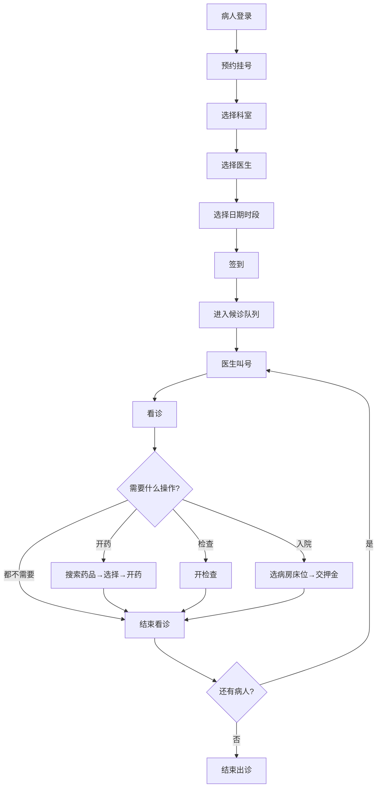
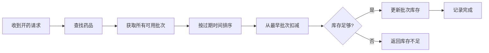
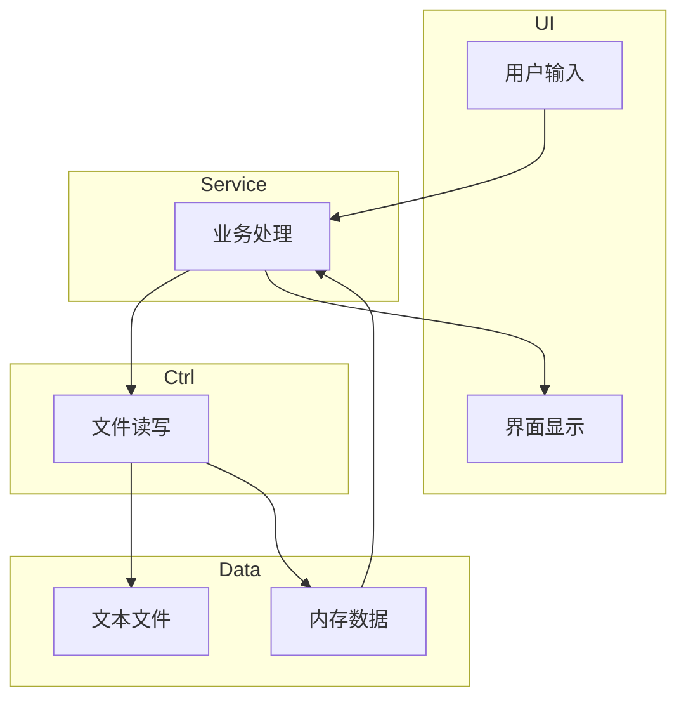

# HIS 医院信息系统 —— 课程设计总结报告

**课程：** C 语言程序设计  
**项目：** 医院信息系统（Hospital Information System）  
**语言：** C11 | **工具：** VS Code + CMake + MinGW  
**成员：** [姓名1]、[姓名2]、[姓名3]、[姓名4]  
**日期：** 2026 年 5 月

---

## 一、系统概述

本项目实现了一个简化但功能完整的医院信息系统，支持三种角色（管理员、医生、病人），覆盖挂号、看诊、开药、检查、入院、出院等完整就诊流程。

### 技术栈

- **语言：** C11 标准
- **构建：** CMake，支持 Debug（ASSERT 生效）/ Release（ASSERT 跳过）两种模式
- **存储：** 文本文件，`|` 分隔，每行一条记录
- **数据结构：** 自实现通用链表，支持任意类型存储

### 三层架构

```
┌─────────────┐
│   UI 层     │  ← 菜单、输入输出（main_ui / root_ui / pat_ui / doc_ui）
├─────────────┤
│ Service 层  │  ← 业务逻辑（挂号、看诊、开药、结算...）
├─────────────┤
│ Ctrl + Entity│  ← 文件读写 + 数据实体（病人、医生、药品...）
└─────────────┘
```

各层职责清晰：UI 负责交互，Service 处理业务，Ctrl 管理数据。

---

## 二、数据约定

### 实体定义

| 实体  | 主要字段                         | 说明       |
| --- | ---------------------------- | -------- |
| 病人  | ID、姓名、性别、出生年月日、身份证号、电话       | 年龄动态计算   |
| 医生  | ID、姓名、性别、出生日期、科室、职称、挂号费、出诊状态 | 科室用枚举    |
| 药品  | ID、名称、零售价、总库存                | 内部按批次管理  |
| 病房  | ID、科室、名称、每日费用                | 内部包含床位列表 |
| 资金  | 病人ID、余额                      | 单位：分     |
| 记录  | ID、操作者、类型、费用、时间戳、详情          | 六种类型共用   |
| 账号  | ID、用户名、密码（加密）、角色             | 密码异或加密   |

### 挂号状态流转

```
预约(APPOINTMENT) → 签到(WAITING) → 看诊中(IN_CONSULTATION) → 完成(COMPLETED)
```

系统启动时自动将过期未签到的预约标记为 COMPLETED。

### 文件格式示例

```
# Patient.txt
1|赵大宝|1|1995|3|10|320101199503101234|13800138001

# Record.txt
1|1|1|REGISTRATION|5000|1716000000|0|1|20260519|1|APPOINTMENT
```

---

## 三、功能模块

### 管理员功能

病人管理（查看/搜索/修改）、医生管理（增删改查/按科室筛选）、药品管理（增删改查/进货/报废批次/查看批次）、病房管理（增删改查/床位明细/按科室筛选）、资金账户总览、全院诊疗记录（按时间排序/按时间筛选）、账号管理、密码管理（改自己密码/重置医生密码）

### 病人功能

查看/修改个人信息、诊疗记录查询、余额查询/充值、医生信息查询、预约挂号（选科室→医生→日期→时段，今天自动过滤已过时段）、签到排队

### 医生功能

开始/结束出诊、叫号、看诊、开检查、开药（先搜索再选）、入院（选病房床位）、出院（自动结算）、换床、换医生、查看队列、结束看诊（手动释放）、改密码

---

## 四、流程图

### 4.1 就诊全流程



### 4.2 药品出库流程（先进先出）



### 4.3 系统架构数据流



---

## 五、运行界面

> 以下为关键功能截图，[截图] 处请替换为实际截图。

### 5.1 登录界面

```
========================================
          医院信息系统 (HIS) v1.0
========================================
请输入账号: 0
请输入密码: ****
登录成功！欢迎您，管理员 root
```

**[截图：登录界面]**

### 5.2 管理员 - 病人列表

```
ID   | 姓名   | 性别 | 年龄 | 电话        | 身份证号
1    | 赵大宝 | 男   | 31   | 13800138001 | 320101199503101234
2    | 钱小花 | 女   | 27   | 13800138002 | 320101199807221235
```

**[截图：病人列表]**

### 5.3 管理员 - 医生管理

```
ID   | 姓名   | 科室 | 职称     | 挂号费
1    | 王建国 | 内科 | 主任医师 | 50.00 元
2    | 李明芳 | 内科 | 主治医师 | 30.00 元
```

**[截图：医生管理界面]**

### 5.4 管理员 - 药品及批次

```
ID   | 药品名称       | 零售价    | 总库存
1    | 阿莫西林胶囊   | 15.00 元  | 97

批次ID | 进价      | 过期时间   | 剩余 | 状态 | 批号
1      | 8.00 元   | 2026-12-31 | 50   | 可用 | BATCH001
```

**[截图：药品批次详情]**

### 5.5 管理员 - 病房床位明细

```
床号 | 状态 | 病人ID | 病人姓名 | 入住时间
1    | 有人 | 5      | 周大牛   | 2026-05-16
2    | 空闲 | ---    | ---      | ---
```

**[截图：床位明细]**

### 5.6 管理员 - 资金账户

```
病人ID | 余额          | 姓名
1      |   2012.10 元  | 赵大宝
2      |   4385.33 元  | 钱小花
```

**[截图：资金账户总览]**

### 5.7 管理员 - 诊疗记录

```
ID | 病人   | 类型 | 时间       | 费用      | 详情
1  | 赵大宝 | 挂号 | 2026-05-16 | 50.00 元  | 内科-王建国 08:30
2  | 赵大宝 | 看诊 | 2026-05-15 | 0.00 元   | 诊断：上呼吸道感染
----------------------------------------------------------
总收入：1234.56 元
```

**[截图：诊疗记录]**

### 5.8 病人 - 预约挂号

```
选择日期：
1. 今天 (2026-05-17)
2. 明天 (2026-05-18)
3. 后天 (2026-05-19)

可选时段（已过滤已过时段）：
9. 12:00-12:30  10. 12:30-13:00  ...  16. 15:30-16:00
```

**[截图：预约挂号界面]**

### 5.9 医生 - 看诊

```
当前看诊病人: 赵大宝 (ID: 1)

1.开始出诊 2.叫号 3.看诊 4.开检查 5.开药
6.入院 7.出院 8.查看队列 9.改密码
10.换床 11.换医生 12.结束看诊 0.结束出诊

请输入诊断: 上呼吸道感染
请输入医嘱: 多喝水，注意休息
看诊记录已保存
```

**[截图：医生工作站]**

---

## 六、测试与结果

### 6.1 测试数据

使用 `generate_test_data.py` 生成固定测试数据，包含：

- 20 个病人，每人初始余额 500~5000 元不等
- 22 个医生，覆盖 11 个科室
- 10 种药品，各有 1~3 个批次
- 7 间病房，共 50+ 床位
- 37 条诊疗记录（挂号/看诊/开药/检查/入院/出院）

### 6.2 测试场景

| 场景 | 流程 | 预期结果 |
|------|------|----------|
| 病人就诊 | 预约→签到→叫号→看诊→开药→结束 | 记录完整，费用正确 |
| 住院结算 | 入院交押金→出院自动扣费 | 余额正确，床位释放 |
| 药品出库 | 开药时按先进先出扣减批次 | 最早批次先扣完 |
| 时段过滤 | 今天预约，已过时段不显示 | 只显示未来时段 |
| 过期清理 | 启动时过期预约自动完成 | 队列干净 |

### 6.3 测试结果

所有场景测试通过，系统运行稳定，数据持久化正确。

---

## 七、错误处理

### 7.1 ASSERT 条件编译

```c
// Debug 模式：检查条件，失败时打印位置并 abort
// Release 模式：空操作，零开销
ASSERT(ptr != NULL, "指针不应为空");
```

### 7.2 safe_malloc

封装 malloc，失败时打印大红报错（含文件名、行号、申请大小），返回 NULL。

### 7.3 统一的 Status 返回值

所有函数返回 Status 枚举，调用者统一处理：

```c
Status s = Serv_root_add_doctor(&pack);
if (s == HIS_OK) printf("成功");
else if (s == HIS_ERR_ALREADY_EXISTS) printf("身份证已存在");
else printf("失败");
```

### 7.4 输入校验

- 数字输入：检查是否为合法整数，拒绝小数和字符
- 字符串输入：检查长度、拒绝空输入、拒绝非法字符 `|`
- 日期输入：逐级校验年/月/日合法性

### 7.5 文件读写保护

- 写入时先备份再覆盖
- 读取时逐行解析，遇到格式错误跳过该行
- 使用 `%[^|\n]` 避免换行符导致的解析错乱

---

## 八、项目亮点

1. **三层架构**：UI-Service-Ctrl 分层清晰，易于扩展和维护
2. **通用链表**：自实现，支持任意类型，插入删除高效
3. **不透明指针**：实现信息隐藏，体现封装思想
4. **药品批次 FIFO**：按过期时间先进先出，接近真实药房管理
5. **排队状态机**：预约→签到→候诊→看诊→完成，状态流转严谨
6. **动态时段过滤**：预约今天时自动隐藏已过时段
7. **条件编译 ASSERT**：Debug 抓 Bug，Release 零开销
8. **日志系统**：关键操作可追溯，具备审计能力

---

## 九、分工

| 成员 | 主要负责 |
|------|---------|
| [组长姓名] | 系统框架总体分析与设计，基本工具与数据结构的实现，服务层的设计与实现，操作界面层实现，代码规范与审查，项目测试与修复，生成测试数据，撰写总结报告 |
| [组员A] | 操作界面层设计：参与界面布局与交互流程的设计讨论，输出界面原型方案；负责项目测试工作，编写测试用例并执行功能测试，记录Bug并协助修复 |
| [组员B] | 实体层的设计与实现：参与病人、医生、药品等核心实体的数据结构设计与编码实现；负责项目漏洞修复，协助排查并解决程序运行中的Bug |
| [组员C] | 数据持久化的设计与实现：参与文件读写模块的设计，负责数据存储格式的制定与实现；负责日志系统的设计与实现，完成关键操作的日志记录功能 |

---

## 十、总结

通过本次课程设计，我们完整经历了一个软件项目的开发流程：需求分析→架构设计→编码实现→测试调试。对 C 语言的指针、内存管理、数据结构、文件操作有了更深入的理解。

项目共约 30 个源文件、5000+ 行代码，实现了医院信息系统的核心功能。虽然只是命令行界面，但三层架构的设计为后续扩展（图形界面、数据库存储）打下了良好基础。
