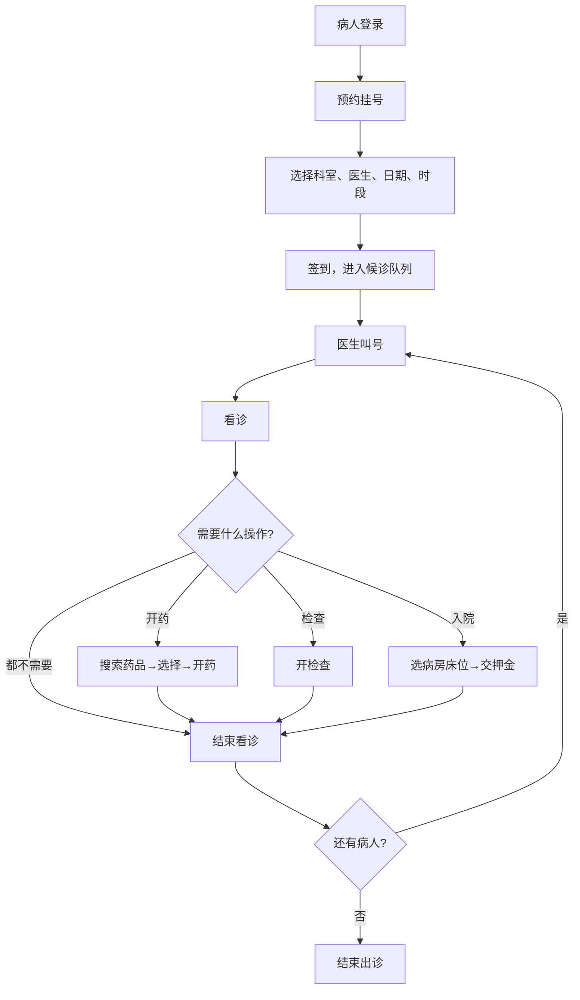
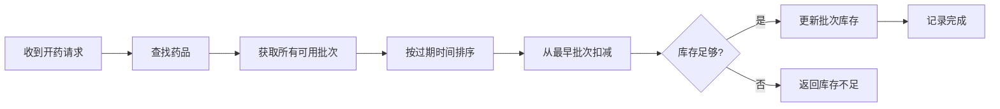
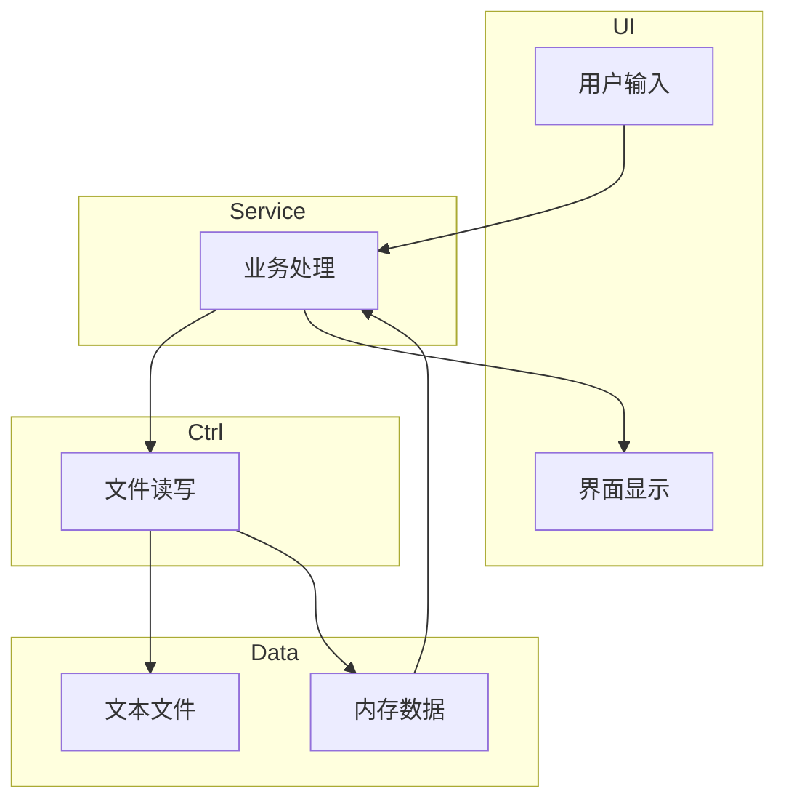

# HIS 医院信息系统 —— 课程设计总结报告

**课程：** C 语言程序设计  
**项目：** 医院信息系统（Hospital Information System）  
**语言：** C11 | **工具：** VS Code + CMake + MinGW  
**成员：** [姓名1]、[姓名2]、[姓名3]、[姓名4]  
**日期：** 2026 年 5 月

---

## 一、系统概述

本项目实现了一个简化但功能完整的医院信息系统，支持三种角色（管理员、医生、病人），覆盖挂号、看诊、开药、检查、入院、出院等完整就诊流程。

### 技术栈

- **语言：** C11 标准
- **构建：** CMake，支持 Debug（ASSERT 生效）/ Release（ASSERT 跳过）两种模式
- **存储：** 文本文件，`|` 分隔，每行一条记录
- **数据结构：** 自实现通用链表，支持任意类型存储

### 三层架构

```
┌─────────────┐
│   UI 层     │  ← 菜单、输入输出（main_ui / root_ui / pat_ui / doc_ui）
├─────────────┤
│ Service 层  │  ← 业务逻辑（挂号、看诊、开药、结算...）
├─────────────┤
│ Ctrl + Entity│  ← 文件读写 + 数据实体（病人、医生、药品...）
└─────────────┘
```

各层职责清晰：UI 负责交互，Service 处理业务，Ctrl 管理数据。

---

## 二、数据约定

### 实体定义

本项目采用**不透明指针**设计模式，所有 `Xxxx_T` 类型均为指向内部结构体的指针，外部只能通过访问器函数获取属性，无法直接访问结构体成员，体现了信息隐藏和封装思想。

以下列出各实体的内部结构体定义（位于 `.c` 文件中，对外不可见）：

#### 病人 (struct Patient_T)

| 成员         | 类型          | 大小       | 说明      |
| ---------- | ----------- | -------- | ------- |
| `id`       | `long long` | 8 bytes  | 病人ID    |
| `birth_ts` | `long long` | 8 bytes  | 出生日期时间戳 |
| `gender`   | `gender`    | 4 bytes  | 性别枚举    |
| `name`     | `char[32]`  | 32 bytes | 姓名      |
| `phone`    | `char[20]`  | 20 bytes | 电话号码    |
| `id_card`  | `char[20]`  | 20 bytes | 身份证号    |

**访问器：** `Patient_id` / `Patient_gender` / `Patient_birth_ts` / `Patient_age` / `Patient_name` / `Patient_phone` / `Patient_id_card`

**更新数据包：** `Patient_Update_Pack` — 包含 gender, birth_ts, name[32], phone[20], id_card[20]

---

#### 医生 (struct Doctor_T)

| 成员 | 类型 | 大小 | 说明 |
|------|------|------|------|
| `id` | `long long` | 8 bytes | 医生ID |
| `birth_ts` | `long long` | 8 bytes | 出生日期时间戳 |
| `reg_fee` | `long long` | 8 bytes | 挂号费（单位：分） |
| `gender` | `gender` | 4 bytes | 性别枚举 |
| `dept` | `Department` | 4 bytes | 科室枚举 |
| `title` | `DoctorTitle` | 4 bytes | 职称枚举 |
| `name` | `char[32]` | 32 bytes | 姓名 |
| `phone` | `char[20]` | 20 bytes | 手机号 |
| `id_card` | `char[20]` | 20 bytes | 身份证号 |
| `is_active` | `bool` | 1 byte | 出诊状态 |

**职称枚举：** `TITLE_RESIDENT`(住院医师) / `TITLE_ATTENDING`(主治医师) / `TITLE_ASSOC_CHIEF`(副主任医师) / `TITLE_CHIEF`(主任医师)

**访问器：** `Doctor_id` / `Doctor_gender` / `Doctor_birth_ts` / `Doctor_age` / `Doctor_is_active` / `Doctor_dept` / `Doctor_title` / `Doctor_name` / `Doctor_phone` / `Doctor_id_card` / `Doctor_reg_fee`

**更新数据包：** `Doctor_Update_Pack` — 包含 gender, birth_ts, dept, title, is_active, name[32], phone[20], id_card[20], reg_fee

---

#### 药品 (struct Medicine_T)

| 成员 | 类型 | 大小 | 说明 |
|------|------|------|------|
| `id` | `long long` | 8 bytes | 药品ID |
| `cur_price` | `long long` | 8 bytes | 零售价（单位：分） |
| `batches` | `List_T` | 8 bytes | 批次链表 |
| `total_remain` | `int` | 4 bytes | 总库存 |
| `name` | `char[32]` | 32 bytes | 药品名称 |

**访问器：** `Medicine_id` / `Medicine_cur_price` / `Medicine_total_remain` / `Medicine_name` / `Medicine_batches`

**核心业务：** `Medicine_deduct(m, amount)` — 按过期时间先进先出扣减库存

---

#### 药品批次 (MedicineBatch) — 公开结构体

| 成员 | 类型 | 说明 |
|------|------|------|
| `id` | `long long` | 批次内部ID |
| `buy_price` | `long long` | 进价（单位：分） |
| `expire_ts` | `long long` | 过期时间戳 |
| `remain` | `int` | 剩余数量 |
| `status` | `BatchStatus` | 状态枚举 |
| `batch_no` | `char[32]` | 批号 |

**批次状态：** `AVAILABLE`(可用) / `EXHAUSTED`(用尽) / `DISCARD`(报废)

---

#### 病房 (struct Ward_T)

| 成员 | 类型 | 大小 | 说明 |
|------|------|------|------|
| `id` | `long long` | 8 bytes | 病房ID |
| `daily_cost` | `long long` | 8 bytes | 每日费用（单位：分） |
| `beds` | `List_T` | 8 bytes | 床位链表 |
| `dept` | `Department` | 4 bytes | 所属科室 |
| `bed_count` | `int` | 4 bytes | 总床位数 |
| `empty_count` | `int` | 4 bytes | 空闲床位数 |
| `ward_name` | `char[32]` | 32 bytes | 病房名称 |

**访问器：** `Ward_id` / `Ward_dept` / `Ward_daily_cost` / `Ward_bed_count` / `Ward_empty_count` / `Ward_beds` / `Ward_name`

**更新数据包：** `Ward_Update_Pack` — 包含 dept, daily_cost, ward_name[32]

---

#### 床位 (Bed_T) — 公开结构体

| 成员 | 类型 | 说明 |
|------|------|------|
| `bed_label` | `int` | 床号 |
| `pat_id` | `long long` | 入住病人ID（0表示空闲） |
| `status` | `BedStatus` | 状态枚举 |
| `start_ts` | `long long` | 入住时间戳（用于计费） |

**床位状态：** `BED_EMPTY`(空闲) / `BED_OCCUPIED`(有人) / `BED_MAINTAIN`(维修)

---

#### 资金账户 (struct Fund_T)

| 成员 | 类型 | 大小 | 说明 |
|------|------|------|------|
| `pat_id` | `long long` | 8 bytes | 病人ID |
| `balance` | `long long` | 8 bytes | 余额（单位：分） |

**访问器：** `Fund_pat_id` / `Fund_balance`

**操作：** `Fund_deposit`(充值) / `Fund_can_afford`(预检) / `Fund_withdraw`(扣费)

---

#### 诊疗记录 (struct Record_T)

| 成员 | 类型 | 大小 | 说明 |
|------|------|------|------|
| `actor_id` | `long long` | 8 bytes | 行为主体ID（病人或管理员） |
| `time_stamp` | `long long` | 8 bytes | 时间戳 |
| `cost` | `long long` | 8 bytes | 费用（单位：分） |
| `detail` | `union` | 最大子结构大小 | 详情联合体 |
| `type` | `RecordType` | 4 bytes | 记录类型枚举 |
| `is_invalid` | `bool` | 1 byte | 是否被废弃 |

**记录类型：** `REC_REGISTRATION`(挂号) / `REC_CONSULTATION`(看诊) / `REC_EXAMINATION`(检查) / `REC_PRESCRIPTION`(开药) / `REC_ADMISSION`(入院) / `REC_DISCHARGE`(出院) / `REC_CHANGE_BED`(换床) / `REC_CHANGE_DOC`(换医生) / `REC_STOCK_IN`(进货) / `REC_STOCK_OUT`(报废)

**详情联合体包含的子结构体：**

| 类型 | 详情结构体 | 关键成员 |
|------|-----------|----------|
| 挂号 | `DataRegistration` | doc_id, sequence_no, target_date, time_frame, status |
| 看诊 | `DataConsultation` | doc_id, diagnosis[128], advice[128] |
| 检查 | `DataExamination` | doc_id, exam_name[64] |
| 开药 | `DataPrescription` | doc_id, med_id, amount |
| 入院 | `DataAdmission` | ward_id, deposit, bed_label |
| 出院 | `DataDischarge` | total_bill, paid |
| 换床 | `DataChangeBed` | from_ward_id, to_ward_id, from_bed_label, to_bed_label |
| 换医生 | `DataChangeDoc` | old_doc_id, new_doc_id |
| 进货 | `DataStockIn` | med_id, batch_id, buy_price, expire_ts, total, batch_no[32] |
| 报废 | `DataStockOut` | med_id, batch_id, total, batch_no[32] |

**挂号状态：** `APPOINTMENT`(预约) → `WAITING`(候诊) → `IN_PROGRESS`(就诊中) → `COMPLETED`(诊毕)

---

#### 账号 (struct Account_T)

| 成员 | 类型 | 大小 | 说明 |
|------|------|------|------|
| `actor_id` | `long long` | 8 bytes | 关联的角色ID |
| `class` | `AccountClass` | 4 bytes | 角色枚举 |
| `name` | `char[32]` | 32 bytes | 用户名 |
| `password` | `char[32]` | 32 bytes | 密码（异或加密存储） |

**角色枚举：** `CLASS_NO_USER` / `CLASS_PATIENT`(病人) / `CLASS_DOCTOR`(医生) / `CLASS_ROOT`(管理员)

**密码验证：** 通过 `Account_check_password(a, pwd)` 验证，内部先对输入做异或加密再比较

### 挂号状态流转

```
预约(APPOINTMENT) → 签到(WAITING) → 看诊中(IN_CONSULTATION) → 完成(COMPLETED)
```

系统启动时自动将过期未签到的预约标记为 COMPLETED。

### 文件格式示例

```
# Patient.txt
1|赵大宝|1|1995|3|10|320101199503101234|13800138001

# Record.txt
1|1|1|REGISTRATION|5000|1716000000|0|1|20260519|1|APPOINTMENT
```

---

## 三、功能模块

### 管理员功能

病人管理（查看/搜索/修改）、医生管理（增删改查/按科室筛选）、药品管理（增删改查/进货/报废批次/查看批次）、病房管理（增删改查/床位明细/按科室筛选）、资金账户总览、全院诊疗记录（按时间排序/按时间筛选）、账号管理、密码管理（改自己密码/重置医生密码）

### 病人功能

查看/修改个人信息、诊疗记录查询、余额查询/充值、医生信息查询、预约挂号（选科室→医生→日期→时段，今天自动过滤已过时段）、签到排队

### 医生功能

开始/结束出诊、叫号、看诊、开检查、开药（先搜索再选）、入院（选病房床位）、出院（自动结算）、换床、换医生、查看队列、结束看诊（手动释放）、改密码

---

## 四、流程图

### 4.1 就诊全流程



### 4.2 药品出库流程（先进先出）



### 4.3 系统架构数据流



---

## 五、运行界面

> 以下为关键功能截图，[截图] 处请替换为实际截图。

### 5.1 登录界面

```
========================================
          医院信息系统 (HIS) v1.0
========================================
请输入账号: 0
请输入密码: ****
登录成功！欢迎您，管理员 root
```

**[截图：登录界面]**

### 5.2 管理员 - 病人列表

```
ID   | 姓名   | 性别 | 年龄 | 电话        | 身份证号
1    | 赵大宝 | 男   | 31   | 13800138001 | 320101199503101234
2    | 钱小花 | 女   | 27   | 13800138002 | 320101199807221235
```

**[截图：病人列表]**

### 5.3 管理员 - 医生管理

```
ID   | 姓名   | 科室 | 职称     | 挂号费
1    | 王建国 | 内科 | 主任医师 | 50.00 元
2    | 李明芳 | 内科 | 主治医师 | 30.00 元
```

**[截图：医生管理界面]**

### 5.4 管理员 - 药品及批次

```
ID   | 药品名称       | 零售价    | 总库存
1    | 阿莫西林胶囊   | 15.00 元  | 97

批次ID | 进价      | 过期时间   | 剩余 | 状态 | 批号
1      | 8.00 元   | 2026-12-31 | 50   | 可用 | BATCH001
```

**[截图：药品批次详情]**

### 5.5 管理员 - 病房床位明细

```
床号 | 状态 | 病人ID | 病人姓名 | 入住时间
1    | 有人 | 5      | 周大牛   | 2026-05-16
2    | 空闲 | ---    | ---      | ---
```

**[截图：床位明细]**

### 5.6 管理员 - 资金账户

```
病人ID | 余额          | 姓名
1      |   2012.10 元  | 赵大宝
2      |   4385.33 元  | 钱小花
```

**[截图：资金账户总览]**

### 5.7 管理员 - 诊疗记录

```
ID | 病人   | 类型 | 时间       | 费用      | 详情
1  | 赵大宝 | 挂号 | 2026-05-16 | 50.00 元  | 内科-王建国 08:30
2  | 赵大宝 | 看诊 | 2026-05-15 | 0.00 元   | 诊断：上呼吸道感染
----------------------------------------------------------
总收入：1234.56 元
```

**[截图：诊疗记录]**

### 5.8 病人 - 预约挂号

```
选择日期：
1. 今天 (2026-05-17)
2. 明天 (2026-05-18)
3. 后天 (2026-05-19)

可选时段（已过滤已过时段）：
9. 12:00-12:30  10. 12:30-13:00  ...  16. 15:30-16:00
```

**[截图：预约挂号界面]**

### 5.9 医生 - 看诊

```
当前看诊病人: 赵大宝 (ID: 1)

1.开始出诊 2.叫号 3.看诊 4.开检查 5.开药
6.入院 7.出院 8.查看队列 9.改密码
10.换床 11.换医生 12.结束看诊 0.结束出诊

请输入诊断: 上呼吸道感染
请输入医嘱: 多喝水，注意休息
看诊记录已保存
```

**[截图：医生工作站]**

---

## 六、测试与结果

### 6.1 测试数据

使用 `generate_test_data.py` 生成固定测试数据，包含：

- 20 个病人，每人初始余额 500~5000 元不等
- 22 个医生，覆盖 11 个科室
- 10 种药品，各有 1~3 个批次
- 7 间病房，共 50+ 床位
- 37 条诊疗记录（挂号/看诊/开药/检查/入院/出院）

### 6.2 测试用例

#### 用例1：病人完整就诊流程

**前置条件：** 测试数据已加载，系统正常运行。

1. 运行 `build/HIS.exe`，显示登录界面
2. 病人登录：账号 `1`，密码 `123` → 进入病人菜单
3. 选择预约挂号（菜单 `2`）→ 显示科室列表
4. 选择科室 `1`（内科）→ 显示内科医生列表
5. 选择医生 `1`（王建国）→ 显示日期选项
6. 选择日期 `2`（明天）→ 显示可选时段
7. 选择时段 `1`（08:00-08:30）→ 预约成功
8. 按回车返回主菜单
9. 选择签到（菜单 `3`）→ 显示该病人预约记录
10. 输入 `1` 确认签到 → 状态变为候诊
11. 退出登录（菜单 `0`）→ 回到登录界面
12. 医生登录：账号 `1`，密码 `123` → 进入医生菜单
13. 开始出诊（菜单 `1`）→ 出诊状态可用
14. 叫号（菜单 `2`）→ 显示病人赵大宝
15. 看诊（菜单 `3`）：诊断 `上呼吸道感染`，医嘱 `多喝水，注意休息` → 记录已保存
16. 开药（菜单 `5`）：搜索 `阿莫西林`，选药品 `1`，数量 `10` → 开药成功，费用 150 元
17. 结束看诊（菜单 `12`）→ 病人释放
18. 结束出诊（菜单 `0`）→ 回到登录界面

**[截图：登录界面]**

**[截图：预约挂号-选择科室]**

**[截图：预约成功]**

**[截图：签到界面]**

**[截图：医生叫号]**

**[截图：看诊界面]**

**[截图：开药界面]**

**结果验证：**
- 生成 1 条挂号记录（费用 50 元）
- 生成 1 条看诊记录（诊断：上呼吸道感染）
- 生成 1 条开药记录（阿莫西林胶囊 × 10，费用 150 元）
- 病人余额扣除 200 元
- 药品批次 BATCH001 库存从 50 减至 40

---

#### 用例2：药品先进先出（FIFO）验证

**前置条件：** 阿莫西林胶囊有两个批次：BATCH001（50 粒，2026-12-31 过期）、BATCH002（100 粒，2027-06-30 过期）。

1. 医生登录：账号 `1`，密码 `123`
2. 开始出诊（菜单 `1`）
3. 叫号（菜单 `2`）
4. 开药（菜单 `5`）：搜索 `阿莫西林`，数量 `60`
5. 管理员登录查看药品批次 → BATCH001 用尽，BATCH002 剩余 90

**[截图：药品批次详情 - 开药前]**

**[截图：药品批次详情 - 开药后]**

**结果验证：**
- BATCH001: 50 → 0（用尽，状态变为 DEPLETED）✅
- BATCH002: 100 → 90 ✅
- 最早批次先出库，符合 FIFO 原则

---

#### 用例3：住院结算

1. 医生登录：账号 `1`，密码 `123`
2. 开始出诊（菜单 `1`）
3. 叫号（菜单 `2`）
4. 入院（菜单 `6`）：选病房 `1`（内科病房），选床位 `1`，押金 `2000` 元
5. 出院（菜单 `7`）→ 自动结算，显示费用明细

**[截图：入院选择床位]**

**[截图：出院结算明细]**

**费用计算：** 内科病房每日 300 元，入住 2 天，费用 = 300 × 2 = 600 元

**结果验证：**
- 押金 2000 元，扣除 600 元，退还 1400 元 ✅
- 床位状态从"有人"变为"空闲" ✅
- 生成 1 条入院记录 + 1 条出院记录 ✅

---

#### 用例4：预约时段过滤

1. 病人登录：账号 `1`，密码 `123`
2. 预约挂号（菜单 `2`）：选科室 `1`，医生 `1`
3. 选择日期 `1`（今天）→ 只显示当前时间之后的时段

**[截图：今天预约 - 已过滤已过时段]**

**结果验证：** 假设当前时间 10:30，则只显示 10:30 之后的时段，08:00~10:00 的时段自动隐藏 ✅

---

#### 用例5：过期预约自动清理

1. 查看 `data/Record.txt` → 存在日期为昨天的 APPOINTMENT 记录
2. 启动 `build/HIS.exe` → 系统自动清理过期预约
3. 管理员登录（账号 `0`，密码 `0`），查看诊疗记录（菜单 `9`）→ 过期记录状态变为 COMPLETED

**结果验证：** 启动时自动扫描所有 APPOINTMENT 状态的记录，若预约日期已过，自动改为 COMPLETED ✅

---

#### 用例6：边界条件测试

| 测试项 | 操作 | 输入 | 预期结果 |
|--------|------|------|----------|
| 余额不足 | 余额 10 元的病人开药 50 元 | 开药数量: `10` | 提示"余额不足"，拒绝操作 |
| 库存不足 | 药品库存 5，开药 10 | 开药数量: `10` | 提示"库存不足" |
| 重复预约 | 同一时段再次预约 | 相同医生、日期、时段 | 提示"已预约" |
| 时段满员 | 某时段已 20 人 | 选择该时段 | 提示"已满" |
| 床位已满 | 所有床位被占用 | 选择该病房 | 提示"无空闲床位" |
| 无效登录 | 错误密码 | 密码: `wrong` | 提示"账号或密码错误" |
| 空输入 | 直接回车 | 不输入任何内容 | 提示"输入无效" |

---

### 6.3 测试总结

所有 6 组测试用例均通过，系统运行稳定，数据持久化正确。核心业务流程（挂号→签到→看诊→开药/检查/入院→出院）完整可用，边界条件处理得当，异常输入有合理提示。

---

## 七、错误处理

### 7.1 ASSERT 条件编译

```c
// Debug 模式：检查条件，失败时打印位置并 abort
// Release 模式：空操作，零开销
ASSERT(ptr != NULL, "指针不应为空");
```

### 7.2 safe_malloc

封装 malloc，失败时打印大红报错（含文件名、行号、申请大小），返回 NULL。

### 7.3 统一的 Status 返回值

所有函数返回 Status 枚举，调用者统一处理：

```c
Status s = Serv_root_add_doctor(&pack);
if (s == HIS_OK) printf("成功");
else if (s == HIS_ERR_ALREADY_EXISTS) printf("身份证已存在");
else printf("失败");
```

### 7.4 输入校验

- 数字输入：检查是否为合法整数，拒绝小数和字符
- 字符串输入：检查长度、拒绝空输入、拒绝非法字符 `|`
- 日期输入：逐级校验年/月/日合法性

### 7.5 文件读写保护

- 写入时先备份再覆盖
- 读取时逐行解析，遇到格式错误跳过该行
- 使用 `%[^|\n]` 避免换行符导致的解析错乱

---

## 八、项目亮点

1. **三层架构**：UI-Service-Ctrl 分层清晰，易于扩展和维护
2. **通用链表**：自实现，支持任意类型，插入删除高效
3. **不透明指针**：实现信息隐藏，体现封装思想
4. **药品批次 FIFO**：按过期时间先进先出，接近真实药房管理
5. **排队状态机**：预约→签到→候诊→看诊→完成，状态流转严谨
6. **动态时段过滤**：预约今天时自动隐藏已过时段
7. **条件编译 ASSERT**：Debug 抓 Bug，Release 零开销
8. **日志系统**：关键操作可追溯，具备审计能力

---

## 九、分工

| 成员 | 主要负责 |
|------|---------|
| [组长姓名] | 系统框架总体分析与设计，基本工具与数据结构的实现，服务层的设计与实现，操作界面层实现，代码规范与审查，项目测试与修复，生成测试数据，撰写总结报告 |
| [组员A] | 操作界面层设计：参与界面布局与交互流程的设计讨论，输出界面原型方案；负责项目测试工作，编写测试用例并执行功能测试，记录Bug并协助修复 |
| [组员B] | 实体层的设计与实现：参与病人、医生、药品等核心实体的数据结构设计与编码实现；负责项目漏洞修复，协助排查并解决程序运行中的Bug |
| [组员C] | 数据持久化的设计与实现：参与文件读写模块的设计，负责数据存储格式的制定与实现；负责日志系统的设计与实现，完成关键操作的日志记录功能 |

---

## 十、总结

通过本次课程设计，我们完整经历了一个软件项目的开发流程：需求分析→架构设计→编码实现→测试调试。对 C 语言的指针、内存管理、数据结构、文件操作有了更深入的理解。

项目共约 30 个源文件、5000+ 行代码，实现了医院信息系统的核心功能。虽然只是命令行界面，但三层架构的设计为后续扩展（图形界面、数据库存储）打下了良好基础。
